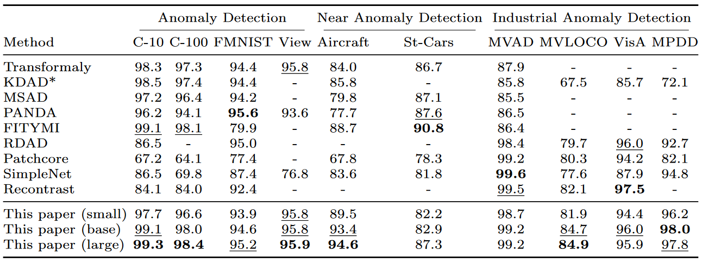
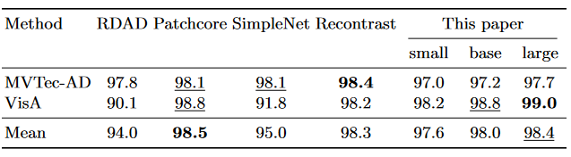
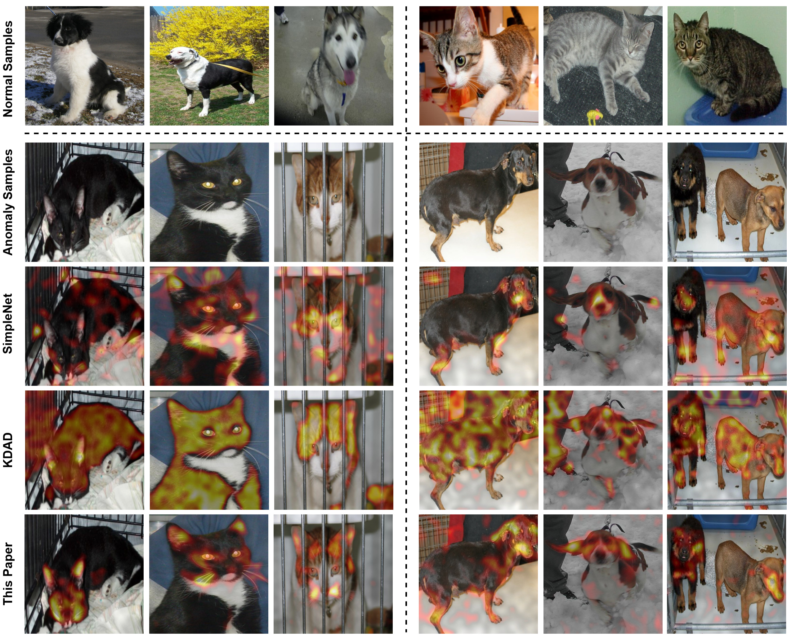

# GeneralAD: Anomaly Detection Across Domains by Attending to Distorted Features

Official PyTorch implementation for "GeneralAD: Anomaly Detection Across Domains by Attending to Distorted Features" ECCV24. For details, see [arXiv](https://arxiv.org/abs/2407.12427).

[Luc P.J. Sträter*](https://scholar.google.com/citations?user=tjKPuEsAAAAJ&hl=en), [Mohammadreza Salehi*](https://scholar.google.com/citations?user=kpT3gcsAAAAJ&hl=en), [Efstratios Gavves](https://www.egavves.com/), [Cees G. M. Snoek](https://www.ceessnoek.info/), [Yuki M. Asano](https://yukimasano.github.io/)  |   University of Amsterdam


## Method
***GeneralAD*** is a versatile anomaly detection framework designed to operate effectively in semantic, near-distribution, and industrial settings with minimal per-task adjustments. It capitalizes on the inherent design of Vision Transformers, which are trained on image patches, thereby ensuring that the last hidden states retain a patch-based structure. Furthermore, it introduces a novel self-supervised anomaly generation module that employs straightforward operations like noise addition and feature shuffling to construct pseudo-abnormal samples from patch features. These features are then fed to an attention-based discriminator, which is trained to score every patch in the image. Through this approach, GeneralAD can both accurately identify anomalies at the image level and generate interpretable anomaly maps, enhancing its utility across various applications.


## Training
<a name="training"> </a>
In the folder `GeneralAD\jobs` you can find job files to run GeneralAD, SimpleNet, and KDAD. The job files include all the necessary hyperparameters to train. For monitoring on WandB add the arguments `wandb_entity` and `wandb_api_key`. If you want to only do inference you have to add the arguments `load_checkpoint` and `checkpoint_dir`. 


## Datasets
CIFAR10, CIFAR100, FGVCAircraft and FashionMNIST are loaded from torchvision directly in the code. To run the other datasets download them here: [MVTec-AD](https://www.mvtec.com/company/research/datasets/mvtec-ad), [MVTec-LOCO](https://www.mvtec.com/company/research/datasets/mvtec-loco), [VisA](https://amazon-visual-anomaly.s3.us-west-2.amazonaws.com/VisA_20220922.tar), [MPDD](https://vutbr-my.sharepoint.com/:f:/g/personal/xjezek16_vutbr_cz/EhHS_ufVigxDo3MC6Lweau0BVMuoCmhMZj6ddamiQ7-FnA?e=oHKCxI), [Standford-Cars](https://www.kaggle.com/datasets/jessicali9530/stanford-cars-dataset), [View](https://www.kaggle.com/datasets/puneet6060/intel-image-classification) and [DogsvsCats](https://www.kaggle.com/c/dogs-vs-cats). 

## Requirements

<a name="requirements"> </a>

Our training process is conducted on a single NVIDIA A100-SXM4-40GB GPU. We recommend using conda for installing the necessary packages. If you haven't installed conda yet, you can find instructions [here](https://www.anaconda.com/download). The steps for installing the requirements are:

1 - Create a new environment from the provided YAML file:

```python
conda env create -f environment.yml
```

2 - Activate the environment:

```
conda activate ls_gpu
```

## Results

We achieve the following image-level AUROC results. To reproduce the results see run_general_ad.job in `GeneralAD\jobs`. To run the job file add the arguments `wandb_entity` and `wandb_api_key` and uncomment the desired dataset.



We achieve the following pixel-level AUROC results. To reproduce the results see run_general_ad.job in `GeneralAD\jobs`. To run the job file add the arguments `wandb_entity` and `wandb_api_key`, change the arguments `val_monitor="pixel_auroc"` and `log_pixel_metrics=1` and uncomment the desired dataset.



We achieve the following qualitative results. To reproduce the results first run GeneralAD, this will save the checkpoints in `lightning_logs` folder. Then change the `checkpoint_dir` argument in run_segmentation.job in `GeneralAD\jobs`.




# Citation

<a name="citation"> </a>

If you find this repository useful, please consider giving a star ⭐ and citation 📣:
``` 
@article{strater2024generalad,
  title={GeneralAD: Anomaly Detection Across Domains by Attending to Distorted Features},
  author={Str{\"a}ter, Luc PJ and Salehi, Mohammadreza and Gavves, Efstratios and Snoek, Cees GM and Asano, Yuki M},
  journal={arXiv preprint arXiv:2407.12427},
  year={2024}
}
```
